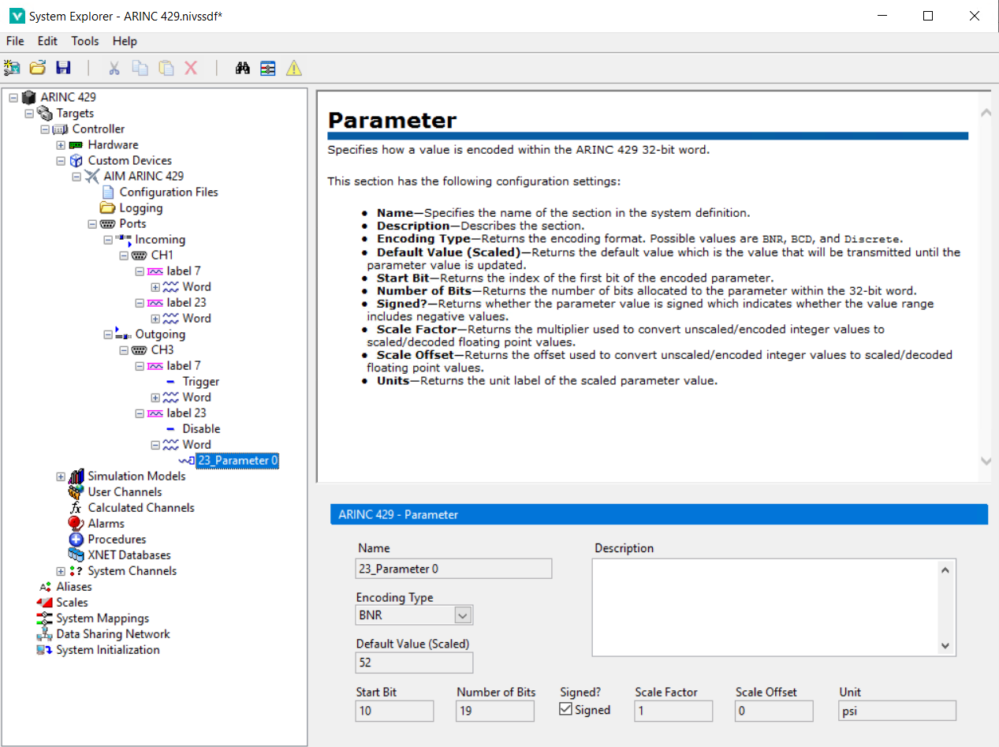
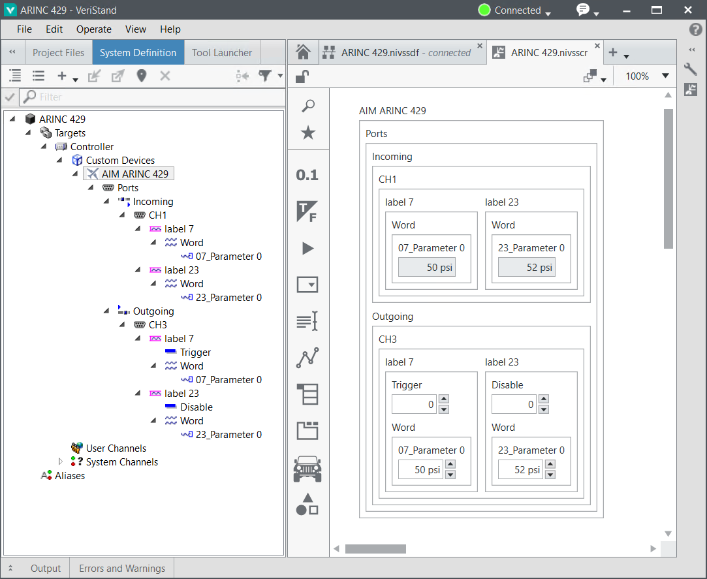

# Using the AIM ARINC 429 Custom Device

This guide demonstrates how to configure and deploy the AIM ARINC 429 custom device.

## Configure the AIM ARINC 429 Hardware

The custom device targets one AIM GmbH ARINC 429 PXI module. To target multiple modules, you must use multiple instances of the custom device.

## Configure the Custom Device

This guide shows two options for configuring the custom device:
- Importing a Parameters file in System Explorer
- Scripting the custom device configuration

### Importing a Parameters file in System Explorer
The Parameters file is generated from an XML schema for configuring the custom device. More information about the Parameters file XML schema can be found in `Docs/Parameters XML File/Parameters XML File.md`.

This example uses a simple example Parameters file found at `Assets/Parameters.xml`.

The files are configured with two ARINC 429 channels each containing the same two labels. The following XML snippet shows the Parameters file configuration of the transmit channel: Label 07 is an acyclic label with one BNR parameter, and Label 23 is a cyclic label with one BNR parameter. The receive channel contains two labels configured identically.

```
	<channel>
		<hardwareChannel>2</hardwareChannel>
		<direction>outgoing</direction>
		<speed>high</speed>
		<label>
			<labelDecimal>07</labelDecimal>
			<transferType>1</transferType>
			<parameter>
				<encoding>BNR</encoding>
				<signed>true</signed>
				<startBit>10</startBit>
				<numberOfBits>19</numberOfBits>
				<scale>1.0</scale>
				<offset>0.0</offset>
				<name>07_Parameter 0</name>
				<unit>psi</unit>
				<defaultValue>50.0</defaultValue>
			</parameter>
		</label>
		<label>
			<labelDecimal>23</labelDecimal>
			<transferType>0</transferType>
			<period>10000</period>
			<parameter>
				<encoding>BNR</encoding>
				<signed>true</signed>
				<startBit>10</startBit>
				<numberOfBits>19</numberOfBits>
				<scale>1.0</scale>
				<offset>0.0</offset>
				<name>23_Parameter 0</name>
				<unit>psi</unit>
				<defaultValue>52.0</defaultValue>
			</parameter>
		</label>
	</channel>
```

Running this example requires wiring Channel 1 to Channel 2 using an appropriate cable.

#### Configure the Custom Device in System Explorer

1. Create a new VeriStand Project and configure your PXI Linux RT target.
2. Navigate to the `Targets\Controller\Hardware\Custom Devices` entry in the tree.
3. Right-click the **Custom Devices** entry and add a new instance of the **NI\AIM ARINC 429** custom device.
4. Use the Main Page to set the **PXI Slot Number** accordingly.

5. Navigate to the **Configuration Files** page.
6. Use the browse button to select the example parameters file at `niveristand-aim-arinc429-custom-device\Docs\User Guide\Assets\Parameters.xml`.


Note: After configuring the custom device, all of the configuration under `Ports` is read-only except for the `Description` field on each page.



#### Scripting the Custom Device Configuration

The AIM ARINC 429 custom device includes a LabVIEW scripting API to configure the custom device programmatically. This allows users to parse an existing ARINC 429 database into a working custom device configuration without the need to create a Parameters file. It also allows importing a Parameters file programmatically instead of through System Explorer.

To use the scripting API, the optional scripting package must be installed:
`ni-aim-arinc-429-veristand-20xx-labview-support`

The scripting API includes two example files inside a LabVIEW example project found at the following directory: `C:\Program Files (x86)\National Instruments\LabVIEW 20xx\examples\NI VeriStand Custom Devices\AIM\ARINC 429\Support`. It contains two example VIs:

- `Import Parameters Configuration to New AIM ARINC 429 Custom Device.vi` - Demonstrates using the AIM ARINC 429 scripting API to configure the custom device by importing a parameters configuration file.
- `Build New AIM ARINC 429 Custom Device.vi` - Demonstrates using the AIM ARINC 429 scripting API to configure the custom device by building from configuration clusters.


### Deploy the System Definition

After configuring the System Definition with the custom device, deploy the System Definition using VeriStand. Once the deployment state reaches **Connected**, use a VeriStand screen to display the custom device inputs and outputs. This example uses VeriStand 2020 R5, so your screen controls may behave differently depending on version.

1. Open a VeriStand Screen
2. Highlight the **System Definition** tree in the left rail
3. Expand the tree to `Targets\Controller\Hardware\Custom Devices\AIM ARINC 429\Ports`
4. Drag the **Ports** item onto the screen
5. Change the values written to the outgoing channel 2 (**07_Parameter 0** and **23_Parameter 0**)
6. Toggle the **Trigger** and **Disable** VeriStand channels under each label to see the behavior reflected to the incoming channels



### Modifying the Custom Device Configuration

Once the custom device is configured, you can change the configuration using the **Configuration Files** page in System Explorer. If the Parameters file changes on disk, use the **Refresh** button. If you need to select a new file, press the button to load a new path into the dialog.

Each time the configuration is changed, the **ARINC 429 Refresh** dialog will be displayed to compare the current and new configurations. Press **Apply** to accept the changes, or **Cancel** to exit without reconfiguring.


## Configuring Logging

The custom device can be configured to log all data received by channels configured to be monitored in the Hardware XML file. The logged data is saved to a .csv file on the real-time target.

To configure logging use the **Logging** page in System Explorer. By default, the **Enable Logging** box is unchecked. Check the **Enable Logging** box and configure the other logging properties to configure the log file. As noted in the help on the page, specify which messages to log using the Hardware XML file. Labels with `monitor="true"` and all labels on channels with `monitorMode="All"` are logged.


When logging is enabled, the log file is opened and written while the system definition is deployed. To stop logging, undeploy the system definition. After retrieving the file from the target, the contents will be saved like the example below. This is the data logged when triggering the acyclic message defined in the User Guide assets (Channel 0, Label 7).

```
time stamp,hardware channel,label,data word
07:36:07.058159,1,7,3758147591
07:36:07.058159,1,7,3758147591
```

To limit the impact on real-time performance, the logged data read from the bus monitor is not converted to parameters. The **channel** and **label** values are read from the message and logged. However, the **data word** is the raw 32-bit value of the message. Converting the two logged data words above to binary notation shows that the first message was carrying a data value of **0b110010** or **0d50**.


Similarly, the second message was carrying a data value of **0b110111** or **0d55**.

